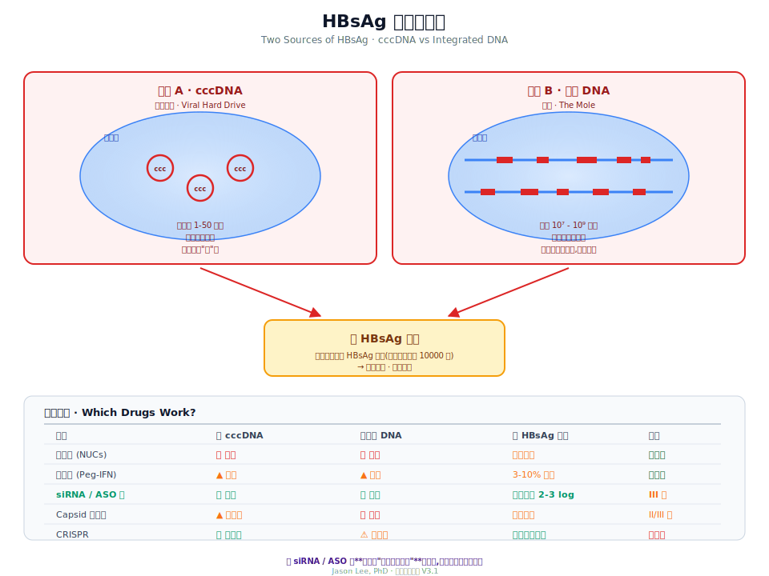

# Ch 4 · HBV DNA Integration:被忽视的另一面

> cccDNA 是主犯,整合 DNA 是"卧底"。

---

## 一个很多患者不知道的事实

只看科普,你大概听过 cccDNA,但**没听过整合**。

一些临床医生也把整合当成细节跳过。

但过去五年,学界越来越确定:

> **长期抗病毒治疗后,血里的 HBsAg 主要不再来自 cccDNA,而是来自整合入宿主基因组的 HBV DNA。**

再读一遍。这句话决定了:**为什么 HBsAg 那么难降,新药到底该打哪里。**

---

## HBV 又不是 HIV,怎么会整合?

好问题。

严格说,HBV **没有整合酶**——它不像 HIV 那样精确插入基因组。

但整合还是会发生,机制不同:

- **HIV 整合** — 自带整合酶,精确插入
- **HBV 整合** — **意外事件**,靠宿主 DNA 修复(NHEJ)把一段线状 HBV DNA "补"进基因组

这个"意外"在肝细胞里其实**经常发生**。

肝炎、氧化应激、细胞分裂——都会让宿主基因组产生双链断裂,修复过程中就把 HBV 拉进来了。

一个感染者的肝脏里,可能有 **10⁷~10⁹ 处整合位点**。

---

## 整合的什么?

整合进去的**不是完整病毒基因组**,是**片段**。

最常整合的是 **S 基因区**(编码 HBsAg)。所以:

- 整合 DNA **能持续产生 HBsAg**
- 但**造不出完整病毒**(缺 pgRNA、C 区、P 区)

也就是说:

> **整合 DNA 是一个"只造 HBsAg,不造病毒"的工厂。**

这就解释了一个奇怪现象——很多长期治疗的患者:

- HBV DNA:测不到
- HBeAg:阴性
- HBsAg:**依然阳性,而且死活降不下去**

**这个顽固的 HBsAg,大概率来自整合。**

---

## cccDNA vs 整合 DNA

| 维度 | cccDNA | 整合 DNA |
|------|--------|---------|
| 位置 | 核内独立微染色体 | 嵌入宿主基因组 |
| 完整性 | 完整 | 片段化(常缺 C/P)|
| 能否造病毒 | 能 | **不能** |
| 能否造 HBsAg | 能 | **能** |
| 数量 | 每细胞 1-50 | 每肝 10⁷-10⁹ |
| 核苷药 | ❌ 无效 | ❌ 无效 |
| **siRNA / ASO** | ✅ **有效** | ✅ **同样有效** |
| CRISPR | ✅ 理论可行 | ⚠️ 伤宿主风险大 |

**记住右下角那几行**——这就是理解新药为什么能做到老药做不到的事情的关键。

---

## 为什么 siRNA / ASO 能"通吃两个来源"

siRNA 和 ASO 打的**不是 DNA,而是 mRNA**。

不管 mRNA 来自 cccDNA 还是整合 DNA,只要序列相同(HBV 的 S 区序列一致),siRNA/ASO 都能识别并降解。

**这就是它们的杀伤力——通吃。**

也是为什么临床试验里,siRNA/ASO 单药能把 HBsAg 降 2-3 个 log,这是核苷药做不到的。

详见第 22、23 章。

---

## 整合的另一个隐患:肝癌

整合还带来更严重的问题——**肝细胞癌(HCC)**。

三个机制:

**① 破坏抑癌基因或激活原癌基因**

如果 HBV 恰好整合到 TERT(端粒酶启动子)、MLL4、CCNE1 这些关键基因附近,可能扰乱它们,推动细胞癌变。

**② HBx 蛋白持续表达**

片段化整合往往**保留了 X 区**。HBx 蛋白能:
- 促进增殖
- 抑制凋亡
- 干扰 DNA 修复
- 表观遗传学重编程

**它是 HBV 相关肝癌的核心驱动之一。**

**③ 基因组不稳定**

大量整合位点意味着大量插入突变——肝细胞基因组变"脆"。

结果:
- 未治疗慢乙肝的肝癌年发病率约 0.5-1%
- 肝硬化患者高达 3-8%/年
- **即便病毒完全被压制,整合带来的癌风险仍然存在**

这就是为什么"功能性治愈"后**肝癌监测不能停**。

---

## 整合什么时候开始?

以前认为整合是慢性感染晚期的事。

**过去五年的研究改变了这个认知——整合在急性感染阶段就开始了**,甚至感染后几周就能测到。

也就是说,就算一个新感染者早期就用药,**已经有一部分肝细胞被"打上标记"**。

所以"越早治疗越好"不仅是保护肝功能,更是**减少整合池的规模**。

---

## 能不能消除整合 DNA?

诚实的答案:**目前不能。**

思路方向:

**A. 让感染细胞死掉** — 免疫疗法 + 治疗性疫苗,唤醒 T 细胞。问题:量太大,一次清光会肝衰竭。

**B. 沉默整合的转录** — 针对 HBx 和 S 启动子做表观修饰。目前无临床级药物。

**C. 长期抑制** — 靠 siRNA/ASO 让整合 DNA "哑巴"。需终身用药,但比核苷药更接近治愈。

**D. 精准 CRISPR** — 位点数量太多(10⁷ 级),难度**远大于 cccDNA 编辑**。

---

## 这一章为什么重要

回到开头那句话:**长期治疗后,HBsAg 主要来自整合 DNA。**

理解这点你就能理解:

1. **为什么老药永远清不了 HBsAg**——它们从没针对整合
2. **为什么 siRNA/ASO 是革命性的**——它们打 mRNA,通吃两个来源
3. **为什么"功能性治愈"是务实目标**——消除整合本身太难
4. **为什么 HBsAg 转阴后肝癌监测也不能停**——整合带来的基因组损伤是永久的

这一章是**思路上的分水岭**——它决定了你看未来新药的角度。

---

## 📍 本章要点

- HBV 无整合酶,整合是**宿主 DNA 修复"意外"**
- 整合在感染早期就发生,可达 10⁷-10⁹ 位点
- 整合 DNA **不造病毒但持续造 HBsAg**
- 长期治疗后,HBsAg 主要来源**从 cccDNA 迁移到整合 DNA**
- **siRNA/ASO 是唯一能"通吃两个来源"的机制**
- 整合与肝癌关系密切,即使 HBsAg 转阴,癌监测继续

---

**延伸阅读**
- Tu T. et al. *HBV DNA Integration*. Viruses. 2021
- Podlaha O. et al. *Genomic Modeling of HBV Integration Frequency*. PLoS ONE. 2019
- Johns Hopkins. *Transcription of HBsAg shifts from cccDNA to integrated HBV DNA during treatment*. 2025

> 下一章 → [Ch 5 · 全球与中国流行病学](./05-流行病学.md)
