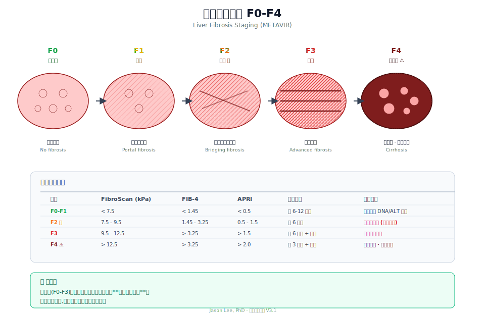

# Ch 12 · 肝纤维化评估

> 病毒是导火索,纤维化是真正在毁掉肝脏的过程。

---

## 为什么纤维化比病毒更重要

一个反直觉的事实——

**病毒本身不直接杀肝细胞。杀肝细胞的是你的免疫系统。**

T 细胞识别到感染细胞,发动攻击 → 感染细胞死亡 → 肝组织出现损伤 → 长期反复,**纤维组织增生**取代正常肝细胞 → 肝纤维化 → 肝硬化 → 肝癌。

所以判断一个乙肝患者的"病情严重程度",最重要的问题不是"病毒多不多",而是——

> **你的肝脏,已经被"改造"到什么程度了?**

---

## 纤维化的四个阶段



国际通用的 **METAVIR 评分**,把肝纤维化分成 5 级:

| 分级 | 状态 |
|------|------|
| **F0** | 无纤维化 |
| **F1** | 门管区扩张 |
| **F2** | 门管区间纤维桥 |
| **F3** | 大量桥接,尚未肝硬化 |
| **F4** | **肝硬化** |

**关键分界:**

- **F2 是治疗的下限触发点** — 大多数指南推荐 F2 及以上开始抗病毒治疗
- **F3-F4 需要每 3-6 个月肝癌筛查**
- **F4(肝硬化)** — 无论 DNA 高低,几乎都要治疗

---

## 评估纤维化的四种方式

| 方法 | 特点 |
|------|------|
| **肝穿刺活检** | 金标准,有创,有出血/疼痛风险 |
| **FibroScan(瞬时弹性成像)** | 无创、快,常用 |
| **FIB-4 指数** | 血液指标算出,免费 |
| **APRI** | 血液指标算出,更简单 |

---

## FibroScan:最常用的无创方法

原理:向肝脏发射低频震动波,测**波传播速度**——纤维化越重,肝脏越硬,波越快。

- 结果以 **kPa** 表示
- 检查 5-10 分钟,不痛
- **中国和欧洲广泛使用,加拿大部分医院也有**

**乙肝患者的 kPa 参考(单位 kPa)**:

| 数值 | 对应 METAVIR |
|------|-------------|
| < 6.0 | F0-F1 |
| 6.0 - 7.5 | F1-F2 |
| 7.5 - 9.5 | **F2**(治疗触发点) |
| 9.5 - 12.5 | F3 |
| > 12.5 | **F4(肝硬化)** |

**注意事项:**

- 空腹检查,吃饭后数值会偏高
- 急性肝炎、ALT 高峰期,数值虚高——先控制炎症再测
- 肥胖、腹水会影响准确性
- 需要复查趋势,不看单次

---

## FIB-4:免费的估算法

**只用四个常规血液指标就能算:**

```
FIB-4 = (年龄 × AST) / (血小板 × √ALT)
```

- 单位:AST/ALT 用 U/L,血小板用 10⁹/L,年龄用岁

**结果解读:**

| FIB-4 | 意义 |
|-------|------|
| < 1.45 | 排除明显纤维化 |
| 1.45 - 3.25 | **灰区** — 建议进一步评估(FibroScan 或肝穿) |
| > 3.25 | 高度提示严重纤维化 / 肝硬化 |

**优点:** 不用任何额外检查,只要你有一份普通血常规 + 肝功能就能算。

**缺点:** 精度不如 FibroScan,对早期纤维化不敏感。

---

## APRI:更简单的估算

```
APRI = (AST / AST 正常上限) / 血小板(10⁹/L) × 100
```

**参考:**

- APRI < 0.5:低概率纤维化
- APRI 0.5 - 1.5:中度
- APRI > 1.5:显著纤维化
- APRI > 2.0:提示肝硬化

**FIB-4 和 APRI 都是 WHO 推荐的低资源环境筛查工具。**

---

## 肝穿刺:金标准,但用得越来越少

肝穿(经皮肝活检)是历史上评估纤维化的金标准。

**优点:**
- 直接看组织学
- 能同时评估炎症、脂肪变、其他病理

**缺点:**
- 有创(超声引导下细针穿刺)
- 疼痛
- 出血风险(极小但存在)
- 取样误差(只取 1/50000 的肝组织)

**现代实践:**

现在多数情况下,**FibroScan + FIB-4 组合**就足够指导治疗决策。肝穿仅在:

- 无创方法结果矛盾
- 怀疑合并其他肝病(自免、脂肪肝、药物性)
- 研究需要

时才做。

---

## 影像学:超声 + CT/MRI

FibroScan 测的是"硬度",超声/CT/MRI 看的是"结构"。

**乙肝患者影像监测节奏:**

| 情况 | 频率 |
|------|------|
| 慢乙肝无肝硬化 | 每 6-12 个月 B 超 + AFP |
| 肝硬化 | 每 3-6 个月 B 超 + AFP,必要时 CT/MRI |
| B 超发现结节 | 增强 CT 或 MRI 进一步鉴别 |

**MRI + Gd-EOB-DTPA(普美显)** 是目前肝癌小病灶诊断最敏感的方法,尤其对 < 2 cm 结节。

---

## 一个组合方案

如果你手里没有 FibroScan,一个实用方案:

1. **每 6-12 个月**做一次常规血检 + 算 FIB-4
2. **FIB-4 < 1.45** — 继续监测,3 年做一次 FibroScan
3. **FIB-4 1.45-3.25 或 FibroScan > 7.5** — 每年 FibroScan
4. **FIB-4 > 3.25 或 FibroScan > 12.5** — 按肝硬化管理

---

## 纤维化可逆吗?

好消息:**在早中期,可以。**

有效抗病毒治疗后,纤维化可以**部分逆转**——甚至一些 F4 患者能回到 F2-F3。

关键是:

- 病毒被持续压制(DNA 长期测不到)
- 炎症消退(ALT 长期正常)
- 时间(至少 3-5 年才看得到显著改善)

**这就是为什么"越早规范治疗,越可能保住甚至恢复肝脏"。**

---

## 📍 本章要点

- 纤维化比病毒更能预测长期风险
- 分级用 **METAVIR F0-F4**,F2 通常是治疗触发点
- **FibroScan 是常用无创工具**,乙肝 kPa 阈值:7.5(F2)、12.5(F4)
- **FIB-4 + APRI 是免费估算法**,只需血常规
- 肝穿是金标准但用得越来越少
- 影像学 + AFP 是**肝癌筛查双保险**
- **纤维化在早中期可逆**——早治疗有意义

---

**延伸阅读**
- EASL Clinical Practice Guidelines: Non-invasive tests for evaluation of liver disease severity
- Chan HL. et al. *Non-invasive assessment of liver fibrosis in Asian patients with chronic HBV*. J Gastroenterol Hepatol

> 下一章 → [Ch 13 · 影像检查](./13-影像检查.md)
