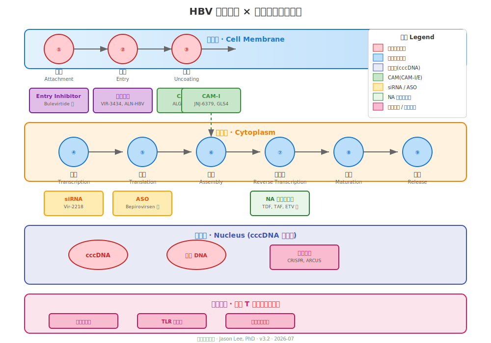

# Ch 21.5 · 新药分类图谱:一张图看懂所有乙肝新药

> 新药名字太多?机制记不住?这一章给你一张总图。

---

## 为什么需要这张图

前面几章分别讲了 siRNA、ASO、CAM、Entry Inhibitor,但如果把它们放在一起,很容易搞混:

- "ALG-000184 和 Bepirovirsen 都是抗病毒的,但一个作用于 core protein,一个作用于 RNA"
- "siRNA 和 ASO 都降抗原,但机制不一样"
- "CRISPR 和 Entry Inhibitor 都听起来很厉害,但根本不是一个层次"

这一章,**把所有在研药物按"作用于 HBV 生命周期的哪一步"排成一张图**。

---

## HBV 生命周期 × 药物作用位点

<p align="center">
  
</p>

---

## 十大类药物总表

| # | 类别 | 机制(一句话) | 代表药物 | 阶段 |
|---|------|------------|---------|------|
| 1 | **NA**(核苷/核苷酸类似物) | 骗过逆转录酶,终止 DNA 链 | TDF, TAF, ETV, LAM | ✅ 已上市 |
| 2 | **CAM**(核衣壳组装调节剂) | 干扰核心蛋白组装,形成空壳或错壳 | ALG-000184, JNJ-6379, GLS4 | Phase 2 |
| 3 | **siRNA**(小干扰 RNA) | 降解病毒 mRNA,切断抗原生产 | Vir-2218, Bepirovirsen 类 | Phase 2 |
| 4 | **ASO**(反义寡核苷酸) | 结合病毒 RNA,招募 RNase H 剪切 | Bepirovirsen(GSK836) | **Phase 3 完成** |
| 5 | **Entry Inhibitor**(入侵抑制剂) | 堵住 NTCP 受体,病毒进不了细胞 | Bulevirtide | ✅ 已上市(丁肝) |
| 6 | **治疗性疫苗** | 唤醒免疫系统识别 HBV 抗原 | NASVAC, Theravax | Phase 2 |
| 7 | **TLR 激动剂** | 激活先天免疫,重启炎症反应 | Selgantolimod, CRD-0547 | Phase 2 |
| 8 | **检查点抑制剂** | 解除 T 细胞耗竭 | Nivolumab 类 | Phase 1/2 |
| 9 | **中和抗体** | 直接结合 HBsAg,清除循环中的表面抗原 | VIR-3434, ALN-HBV | Phase 2 |
| 10 | **基因编辑** | 直接剪切 cccDNA 或整合 DNA | CRISPR, ARCUS | 临床前 |

---

## 按"治疗目标"再分一次

### A. 压制病毒复制(降 DNA)

这些药**不降 HBsAg**,但能把病毒量压下来:

- **NA**(TDF, TAF, ETV)
- **CAM**(ALG-000184, JNJ-6379)

**作用:** 让 HBV DNA 检测不到,但不能实现功能性治愈。

### B. 降低抗原(降 HBsAg)

这些药能**显著降 HBsAg**,是功能性治愈的关键拼图:

- **siRNA**(Vir-2218 类)
- **ASO**(Bepirovirsen)
- **中和抗体**(VIR-3434)

**作用:** 把 HBsAg 从几万降到几百甚至几十,为免疫清除创造条件。

### C. 激活免疫系统

这些药**不直接抗病毒**,而是帮助免疫系统识别和清除感染细胞:

- **治疗性疫苗**(NASVAC, Theravax)
- **TLR 激动剂**(Selgantolimod)
- **检查点抑制剂**(Nivolumab 类)

**作用:** 让免疫系统"醒过来",清除残余感染。

### D. 攻击病毒"硬盘"(cccDNA / 整合 DNA)

这些药直接针对病毒在肝细胞里的"存储":

- **基因编辑**(CRISPR, ARCUS)
- **部分 CAM**(ALG-000184 可能阻断 cccDNA 补充)

**作用:** 减少或清除 cccDNA,实现彻底治愈的关键。

---

## 联合疗法的逻辑

**单一类别很难实现治愈**。目前学界共识是:

```
第 1 步:压病毒(DNA 检测不到)
  → NA 或 CAM

第 2 步:降抗原(HBsAg 大幅下降)
  → siRNA + ASO + 中和抗体(任选 1-2 种)

第 3 步:激活免疫(清除残余)
  → 治疗性疫苗 或 TLR 激动剂

第 4 步:攻击硬盘(可选,未来)
  → 基因编辑
```

**每一步都需要前一步的基础**。这就是为什么未来一定是联合方案。

---

## 你(患者)最该记住的三件事

1. **所有新药都在 HBV 生命周期的某个环节起作用**——没有"万能药"
2. **降 DNA ≠ 降 HBsAg ≠ 治愈**——这是三个不同的目标,需要不同的药
3. **联合方案是方向**——未来你的处方可能是 2-3 种机制不同的药组合

---

## 📍 本章要点

- HBV 生命周期有 7 个基本步骤,每个步骤都有对应的在研药物
- 十大类药物按机制分为四类:压病毒、降抗原、激活免疫、攻击硬盘
- 单一类别很难治愈,联合方案是未来
- 理解药物的"作用位点"比记住药名更重要

---

**延伸阅读**
- 各章节对应的具体药物详解(siRNA → Ch 22, ASO → Ch 23, CAM → Ch 24 等)
- 附录 C:全球在研公司与管线地图

> 上一篇 → [Ch 21 为什么未来一定是联合疗法](./21-联合疗法.md)
> 下一篇 → [Ch 22 siRNA](./22-siRNA.md)
