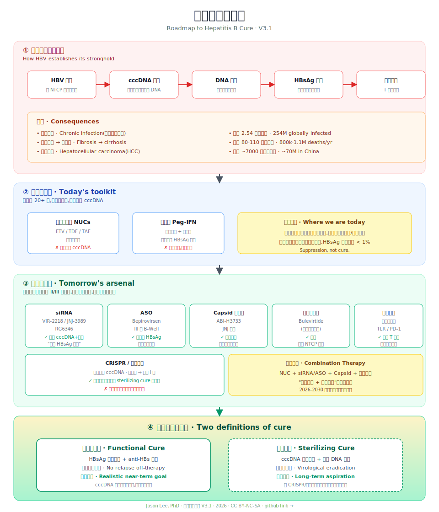

# 乙肝治愈手册 · A Patient's Guide to Hepatitis B Cure

> 从病毒到治愈,一位患者的探索与整理
> A patient-scientist's map from virus to cure

**版本 Version**: V3.1 · 第一篇 What 初稿完成
**作者 Author**: Jason Lee, PhD
**中文版**: 主线(本仓库)· **[English Version](./en/README.md)**: 完整翻译于 `/en/` 目录
**免费阅读 Free to Read**: 全部内容永久开放,不收费、不带广告
**多语言计划 · Multilingual Plan**: 见下方路线图(目标 12 种语言)

---

## 关于这本书

我不是医生。我是一名天生的乙肝病毒携带者,也是一名工程师和研究者。

过去很多年,我一直在追踪这个病:读论文、看临床试验、跟踪新药管线、和医生、其他患者交流。慢慢地我发现了一件事——

**科学界已经在讨论"治愈"了,而很多患者还在为一份看不懂的化验单发愁。**

这本书,就是想把这道鸿沟填一点点。它不是医学教材,替代不了医生;它是一份患者的整理笔记,一张写给同行者的地图。

**这本书永远免费。** 你可以自由阅读、下载、转发、翻译。只希望不要用它做商业售卖,也希望你告诉更多需要它的人。

---

## 一张图看懂这本书 · The Whole Book in One Picture

  

English version

  

这张图是全书的骨架:

1. **病毒如何建立据点** —— 第一篇 What(Ch 1-5)
2. **今天的武器** —— 第四篇 How(Ch 15-20)
3. **明天的武器** —— 第五篇 New Research(Ch 21-29)
4. **治愈的两个终点** —— 第六篇 Future(Ch 30-34)

你可以从任意一格进入,读到你关心的那一章。

---

## 目录

### 序
- [序言 · 为什么我要写这本书](./00-序言.md)
- [如何阅读这本书](./00-如何阅读.md)

### 第一篇 What · 认识乙肝
- [Ch 1 从一滴血说起](./01-从一滴血说起.md)
- [Ch 2 HBV 病毒学基础](./02-HBV病毒学基础.md)
- [Ch 3 cccDNA:病毒的"硬盘"](./03-cccDNA.md)
- [Ch 4 HBV DNA Integration:被忽视的另一面](./04-HBV-DNA-Integration.md)
- [Ch 5 全球与中国流行病学](./05-流行病学.md)

### 第二篇 Why · 为什么这么难治
- [Ch 6 免疫耐受与 T 细胞耗竭](./06-免疫耐受.md)
- [Ch 7 cccDNA 为什么清不掉](./07-cccDNA清不掉.md)
- [Ch 8 HBsAg 从哪里来](./08-HBsAg来源.md)
- [Ch 9 乙肝 vs 丙肝 vs HIV](./09-HBV-vs-HCV-vs-HIV.md)

### 第三篇 Diagnosis · 读懂自己的病
- [Ch 10 化验单逐项解读](./10-化验单.md)
- [Ch 11 病毒载量与 HBsAg 定量的意义](./11-病毒载量.md)
- [Ch 12 肝纤维化评估](./12-肝纤维化.md)
- [Ch 13 影像检查](./13-影像检查.md)
- [Ch 14 谁需要治疗:三大指南对比](./14-指南对比.md)

### 第四篇 How · 今天怎么治
- [Ch 15 核苷(酸)类似物](./15-核苷类药物.md)
- [Ch 16 长期用药的骨、肾与代谢管理](./16-长期用药管理.md)
- [Ch 17 干扰素:老药新用](./17-干扰素.md)
- [Ch 18 什么是"功能性治愈"](./18-功能性治愈.md)
- [Ch 19 停药的科学](./19-停药.md)
- [Ch 20 生活方式](./20-生活方式.md)

### 第五篇 New Research · 新药革命
- [Ch 21 为什么未来一定是联合疗法](./21-联合疗法.md)
- [Ch 22 siRNA](./22-siRNA.md)
- [Ch 23 ASO 与 Bepirovirsen](./23-ASO.md)
- [Ch 24 Capsid Assembly Modulator](./24-Capsid.md)
- [Ch 25 Entry Inhibitor 与 Bulevirtide](./25-Entry.md)
- [Ch 26 治疗性疫苗](./26-治疗性疫苗.md)
- [Ch 27 免疫疗法](./27-免疫疗法.md)
- [Ch 28 CRISPR 与基因编辑](./28-CRISPR.md)
- [Ch 29 组合方案盘点](./29-组合方案.md)

### 第六篇 Future · 未来十年
- [Ch 30 从功能性治愈到彻底治愈](./30-两种治愈.md)
- [Ch 31 AI 与药物研发](./31-AI.md)
- [Ch 32 个体化治疗](./32-个体化治疗.md)
- [Ch 33 疫苗根除的可能性](./33-疫苗根除.md)
- [Ch 34 患者该怎么办](./34-患者怎么办.md)

### 第七篇 Summary · 我的探索与总结
- [Ch 35 一个患者如何读论文](./35-读论文.md)
- [Ch 36 如何评估一个"新药"](./36-评估新药.md)
- [Ch 37 如何辨别假消息与"神药"](./37-辨别神药.md)
- [Ch 38 患者社群与信息源](./38-社群信息.md)
- [Ch 39 全书路线图总汇](./39-总路线图.md)

### 附录
- [A · HBV 术语与缩写词典](./A-术语词典.md)
- [B · 药物研发时间线](./B-时间线.md)
- [C · 全球在研公司与管线地图](./C-公司地图.md)
- [D · 关键临床试验索引](./D-试验索引.md)
- [E · 患者 100 问 FAQ](./E-FAQ.md)
- [F · 参考文献与推荐阅读](./F-参考文献.md)

---

## 版本记录

| 版本 | 日期 | 变更 |
|------|------|------|
| V3.2 | 2026-07-05 | **多语言路线图发布**:12 种语言规划(中/英/韩/越/Tagalog/法/斯瓦希里/印地/孟加拉/乌尔都/印尼/阿拉伯/俄) |
| V3.1 | 2026-07-05 | 全书 39 章 + 附录 A-F 初稿完成;数据待统一核对(WHO 2025 报告、Polaris) |
| V3.0 | 2026-07 | 目录框架重构:7 篇 39 章 |
| V2.0 | — | 8 篇结构 |
| V1.0 | — | 大纲雏形 |

---

## 还没做的事(欢迎 PR)

- [ ] 数据统一核对:WHO 最新报告、Polaris Observatory 数据集
- [ ] 英文版翻译(`/en` 目录)补完 Ch 24-34
- [ ] 每章末尾"关键论文清单"补齐
- [ ] 图表可视化:cccDNA 生命周期、生命周期与药物对应
- [ ] 每年跟踪新药临床数据更新
- [ ] **多语言翻译**:12 种语言路线图见下

---

## 🌍 多语言路线图 · Multilingual Roadmap

乙肝是全球性疾病,但知识不应该有语言壁垒。我们计划把这本书翻译成 **12 种语言**,优先覆盖乙肝高流行区和高人口语种。

| 语言 | 代码 | 状态 | 目录 | 优先级理由 |
|------|------|------|------|-----------|
| 🇨🇳 中文 | `zh` | ✅ 已完成 | `/`(根目录) | 作者母语;全球 HBV 负担最重地区之一 |
| 🇬🇧 English | `en` | 🚧 进行中 | `/en/` | 国际通用语;Ch 24-34 待补 |
| 🇰🇷 한국어 | `ko` | 📋 计划 | `/ko/` | 东亚高流行区;医学翻译资源丰富 |
| 🇻🇳 Tiếng Việt | `vi` | 📋 计划 | `/vi/` | 东南亚高流行区;患者群体庞大 |
| 🇵🇭 Tagalog | `tl` | 📋 计划 | `/tl/` | 菲律宾高流行区;东南亚患者需求 |
| 🇫🇷 Français | `fr` | 📋 计划 | `/fr/` | 覆盖非洲法语区(西非 HBV 高负担) |
| 🇰🇪 Kiswahili | `sw` | 📋 计划 | `/sw/` | 东非通用语;非洲 HBV 负担重 |
| 🇮🇳 हिन्दी | `hi` | 📋 计划 | `/hi/` | 印度人口众多;HBV 负担重 |
| 🇧🇩 বাংলা | `bn` | 📋 计划 | `/bn/` | 孟加拉/印度西孟加拉;高流行区 |
| 🇵🇰 اردو | `ur` | 📋 计划 | `/ur/` | 巴基斯坦;HBV 高负担国家 |
| 🇮🇩 Bahasa Indonesia | `id` | 📋 计划 | `/id/` | 印尼人口第四;高流行区 |
| 🇸🇦 العربية | `ar` | 📋 计划 | `/ar/` | 覆盖中东 / 北非阿拉伯语区 |
| 🇷🇺 Русский | `ru` | 📋 计划 | `/ru/` | 覆盖中亚 / 东欧 HBV 负担区 |

### 翻译优先级分组

**第一梯队(已启动)**:中文 → 英文(2026 Q3 完成)

**第二梯队(HBV 高流行 + 高人口)**:韩文、越南语、Tagalog、印尼语、印地语、孟加拉语
- 这些地区合计覆盖全球 ~70% 的 HBV 感染者
- 计划 2026 Q4 – 2027 启动

**第三梯队(区域通用语)**:法语、斯瓦希里语、乌尔都语、阿拉伯语、俄语
- 通过区域通用语覆盖多个国家
- 计划 2027 启动

### 为什么是这 12 种?

- **流行病学**:前 10 大 HBV 负担国家(中国、印尼、尼日利亚、孟加拉、越南、印度、巴基斯坦、菲律宾、韩国、埃及)的语言全覆盖
- **人口覆盖**:这 12 种语言覆盖全球 ~60% 人口
- **区域通用性**:法语/斯瓦希里语/阿拉伯语/俄语 各覆盖数十个国家的医疗系统

### 想加入翻译?

1. **Issue 报名**:在 GitHub 开一个 `[Translation] <语言名>` 的 issue,说明你负责的语言和大致进度
2. **建目录**:按语言代码建 `/ko/`、`/vi/` 等目录,文件命名和英文版一致
3. **术语统一**:每种语言建一份 `GLOSSARY.md`,和主词典 `A-术语词典.md` 对应
4. **校对**:至少两位母语者交叉校对后再合并到主线

**译者致谢**:每位贡献者会在对应语言版本的 README 里署名。

---

## 参与贡献

**发现错误?数据过时?想补充临床经验?想翻译?**

- **GitHub Issue** — 提交问题
- **Pull Request** — 直接改
- **翻译** — 见上方 🌍 多语言路线图,欢迎加入任何语种的翻译团队

**我不追求完美,追求逐步接近真相。**

---

## 声明

本书内容不构成医疗建议。任何用药和治疗决定,请咨询专业医生。

**任何依据本书内容做出的健康决策后果,由决策者本人承担。作者不承担任何直接或间接的医疗、法律或经济责任。**
