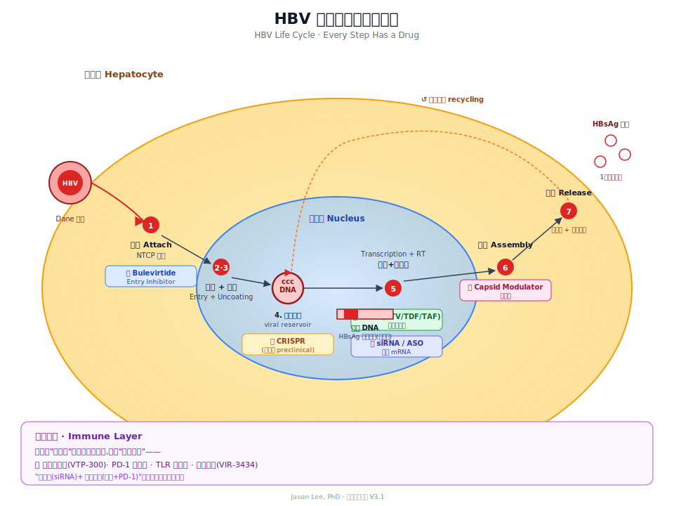

# Ch 2 · HBV Virology Basics

> To understand why it's so hard to treat, first understand how "clever" the virus is.

---

## A ridiculously tiny virus

Look at this comparison:

| Virus | Genome | Proteins encoded |
|------|--------|---------|
| HIV | 9700 bp | ~15 |
| HCV (Hepatitis C) | 9600 bp | ~10 |
| **HBV (Hepatitis B)** | **3200 bp** | **7** |
| SARS-CoV-2 | 30000 bp | ~29 |

HBV is the smallest of the bunch. And yet it's the one chronic viral infection that current drugs **basically can't clear**.

That's not luck. **Evolution compressed it to the extreme.**

---

## What the virus looks like

Put HBV-infected serum under an electron microscope and you'll see three kinds of particles:

1. **Dane particle** — the complete virus, 42 nm, the actual infectious "full body"
2. **Spherical particles** — 22 nm, the most numerous
3. **Tubular particles** — long rods

Types 2 and 3 have **no viral DNA**. They're empty shells made of HBsAg. In the blood, the empty shells outnumber the real virions by **more than 10,000 to 1**.

> 🧠 This detail matters — HBV mass-produces "decoys" to burn through your antibodies. That's its first immune-evasion trick.

The complete virus, from outside to inside, has three layers:

- **Envelope** — studded with HBsAg
- **Capsid** — a "vault" made of HBcAg
- **Core** — a partially double-stranded circular DNA + a reverse transcriptase

---

## A genome compressed to the max

3.2 kb encoding 7 proteins — how?

The answer: **four open reading frames that overlap each other**. The same stretch of DNA, read from different starting points, translates into different proteins.

| Gene region | Product | Function |
|--------|------|------|
| S | HBsAg | Surface protein |
| C | HBcAg / HBeAg | Core / secreted e antigen |
| P | Polymerase | Replication |
| X | HBx | Regulates transcription, linked to liver cancer |

**HBeAg is the odd one out** — it's not part of the virus structure, but is actively secreted into the blood. Its job is to **numb the immune system**, making T cells tolerant to HBV.

Clinically, "HBeAg positive/negative" is an important checkpoint — it marks a shift in the relationship between virus and immunity.

---

## Life cycle (seven steps)

**This is the most important figure in the whole book.** Take your time.



Text version:

```
① Attachment → ② Entry → ③ Uncoating → ④ cccDNA formation
                                                │
                                                ▼
⑦ Release ← ⑥ Assembly ← ⑤ Transcription / reverse transcription
```

**① Attachment**

The preS1 domain on HBV's surface recognizes a receptor on liver cells called **NTCP**. NTCP only exists on hepatocytes, so HBV **only infects the liver**.

🔑 The already-approved **Bulevirtide** works by grabbing NTCP so the virus can't get in.

**② Entry & ③ Uncoating**

The virus is engulfed by the cell, the shell opens, and DNA is delivered into the nucleus.

The DNA that enters is incomplete, called **rcDNA** (relaxed circular DNA).

**④ cccDNA formation (the key step!)**

rcDNA gets patched up inside the nucleus into a fully closed loop — **cccDNA**.

- It's the "viral hard drive"
- Stably present for decades
- **No existing drug can clear it**

Next chapter is dedicated to this.

**⑤ Transcription & reverse transcription**

cccDNA gets transcribed into several mRNAs, the most important being **pgRNA**.

Once pgRNA leaves the nucleus: part gets translated into proteins; part gets packed into new capsids, where reverse transcriptase turns it back into DNA.

🔑 **Nucleoside analogs (ETV/TDF/TAF) jam this step** — they impersonate natural nucleosides, so reverse transcription stalls.

**⑥ Assembly**

Core proteins wrap around pgRNA + polymerase, forming a new capsid.

🔑 **Capsid Assembly Modulators (CAMs)** are new drugs that stop this from happening.

**⑦ Release & recycling**

New virus goes out to infect the next hepatocyte. At the same time, **some capsids recycle back into the nucleus, refilling the cccDNA pool**.

**As long as one cccDNA remains, it can keep copying itself.**

---

## Every step matches a drug class

Line up the life cycle against the drugs and the HBV drug landscape gets clear:

| Step | Drug class | Example |
|------|---------|-------|
| ① Attachment | Entry Inhibitor | Bulevirtide |
| ④ cccDNA | (No drug yet) CRISPR in development | — |
| ⑤ Reverse transcription | Nucleoside analogs (NUCs) | ETV / TDF / TAF |
| ⑤ mRNA | siRNA / ASO | Bepirovirsen, VIR-2218 |
| ⑥ Assembly | Capsid Modulator | ABI-H3733 |
| HBsAg export | siRNA / ASO | (same as above) |
| Immune tolerance | Therapeutic vaccine / PD-1 / TLR | multiple in development |

**Remember one sentence: today's drugs can lock down replication but can't lock down cccDNA. The new drugs are attacking the steps the old drugs can't reach.**

---

## Why HBV can both mutate and hide

HBV has a DNA genome, but to replicate it has to **first turn into RNA, then reverse-transcribe back to DNA**. This kind of virus is called a **pararetrovirus**.

This hybrid setup gives it two big advantages:

1. **Fast mutation** — reverse transcription has no proofreading, so the virus dodges immunity and drugs quickly
2. **Stable storage** — what ends up in the nucleus is DNA (cccDNA), not fragile like an RNA virus

**Mutates fast, hides well.** That's the core reason it's so hard to deal with.

---

## Genotypes: A to J

HBV has 10 genotypes, labeled with capital letters A through J.

Roughly where they live:

- **A** — Europe, North America
- **B / C** — East Asia (in China it's mostly these two)
- **D** — Mediterranean, Middle East, India
- **E** — West Africa
- **F / H** — Central and South America

Genotype isn't trivia:

- **Type C** carries a higher liver cancer risk than type B
- **Type A** responds best to interferon
- Chinese patients are mostly B and C — B more in the south, C more in the north

---

## 📍 Key Points

- HBV genome is only 3.2 kb, using overlapping reading frames to encode 7 proteins
- 99.99% of what's in the blood is empty shells, used to burn through antibodies
- 7-step life cycle, each step matching a class of drug
- **cccDNA is the core problem**, current drugs can't clear it
- HBV both mutates fast and hides long-term (pararetrovirus)
- Chinese patients are mainly B/C genotypes

---

**Further Reading**
- Seeger C, Mason WS. *Molecular biology of hepatitis B virus infection*. Virology. 2015
- Yan H. et al. *NTCP is a functional receptor for HBV and HDV*. eLife. 2012
- Nassal M. *HBV cccDNA: key obstacle for a cure*. Gut. 2015

> Next chapter → [Ch 3 · cccDNA: The Virus's "Hard Drive"](./03-cccdna.md)
