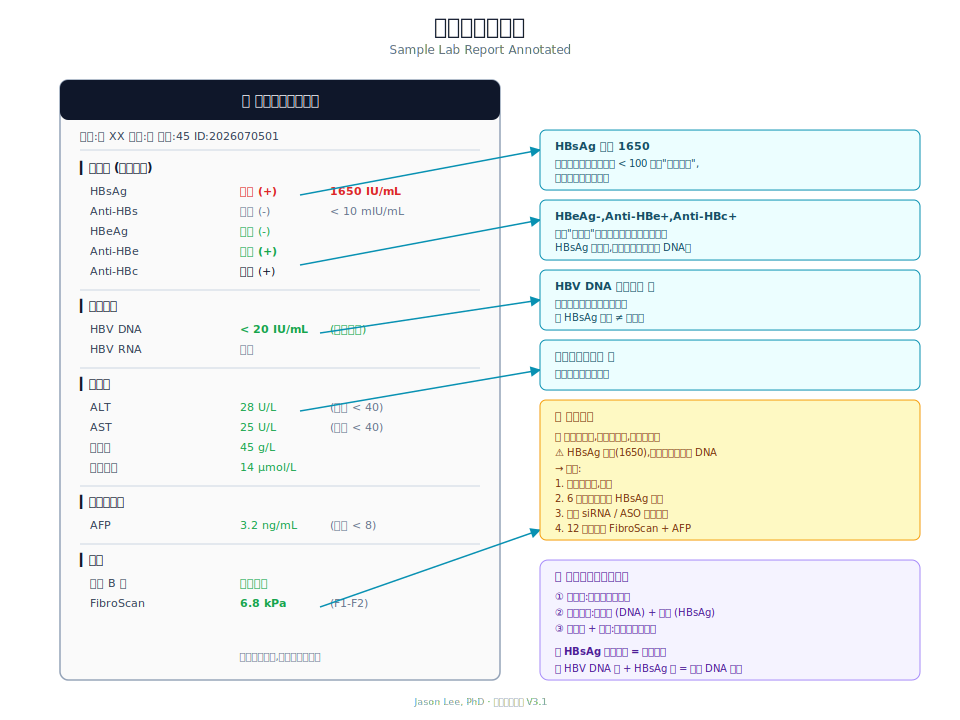

# Ch 10 · Reading a Lab Report

> That paper in your hand, line by line.

---

## Start with the big picture: three groups of numbers

A complete hepatitis B lab report usually has three groups:

1. **Two-and-a-half pairs (the five HBV markers)** — your relationship with the virus
2. **Viral quantitation** — how active the virus is
3. **Liver function + tumor markers** — how much damage, and cancer risk

We'll go through them one by one.

---

## Group 1: the five markers

"Two-and-a-half pairs" is old shorthand for five markers:

| Marker | Full name | What it means |
|------|------|------|
| **HBsAg** | Hepatitis B surface antigen | **Are you infected?** |
| **Anti-HBs** | Surface antibody | Do you have immunity? |
| **HBeAg** | e antigen | Is the virus active? |
| **Anti-HBe** | e antibody | Is the virus suppressed? |
| **Anti-HBc** | Core antibody | Have you ever met HBV? |

**Clinical meaning of each:**

### HBsAg (surface antigen)

- **Positive** = HBV is in your body
- Positive for more than 6 months = **chronic infection**
- Quantitative level = reflects viral replication + integrated DNA expression
- Goal = **clearance** (functional cure)

### Anti-HBs (surface antibody)

- **Positive** = you have immunity and are protected from infection
- Source: after vaccination, or recovery from natural infection
- Quantitative ≥ 10 mIU/mL = protective level

### HBeAg (e antigen)

- **Positive** = active viral replication, highly infectious
- Negative = usually means the virus is suppressed (or has escaped by mutation)
- HBeAg turning negative = a key milestone in chronic HBV, called **seroconversion**

### Anti-HBe (e antibody)

- **Positive** = your immune system is starting to suppress the virus
- Usually shows up as HBeAg turns negative

### Anti-HBc (core antibody)

- **Positive** = you **have been** or **are** infected with HBV
- Vaccines do not produce Anti-HBc, so it's evidence of "past contact with HBV"

---

## How to read common combinations

**Combo 1: big three positive (大三阳)**
- HBsAg ✅ HBeAg ✅ Anti-HBc ✅
- Meaning: chronic infection + active virus + high infectiousness
- Usually needs treatment

**Combo 2: small three positive (小三阳)**
- HBsAg ✅ Anti-HBe ✅ Anti-HBc ✅
- Meaning: chronic infection + virus suppressed (or mutated)
- Need to check DNA quantitation to decide on treatment

**Combo 3: recovered**
- Anti-HBs ✅ Anti-HBc ✅
- Meaning: was infected, has cleared, has immunity

**Combo 4: vaccine protection**
- Only Anti-HBs ✅
- Meaning: vaccinated, has immunity

**Combo 5: window period or atypical**
- Only Anti-HBc ✅
- Meaning: could be occult infection, or antibodies fading years after infection. Need to check HBV DNA further

**Combo 6: never infected, never vaccinated**
- All five negative
- Meaning: get vaccinated

---

## Group 2: viral quantitation

### HBV DNA

- Units: IU/mL or copies/mL (1 IU ≈ 5 copies)
- Reflects **current** viral replication
- Goal: **undetectable** after treatment (<20 IU/mL or <10 IU/mL, depending on the kit)

**Range reference:**
- High active replication: > 10⁶ IU/mL
- Medium: 10⁴-10⁶
- Low: < 10⁴
- Undetectable: < 20

### HBsAg quantitation

- Unit: IU/mL
- Reflects "total antigen output" (cccDNA + integrated)
- The key marker for **cure assessment**
- Goal: **drop to undetectable**

**Range reference:**
- High: > 10⁴ IU/mL
- Medium: 10³-10⁴
- Low: < 10³
- Very low (close to cure): < 100
- Gone: < 0.05

### HBV RNA (new marker)

- Reflects **cccDNA transcription activity**
- Used in new drug trials and when evaluating when to stop treatment
- Not yet common in routine clinical use

### HBcrAg (new marker)

- Reflects **total cccDNA pool activity**
- Predicts post-treatment rebound and HCC risk
- Mainly used in Japan and in research

---

## Group 3: liver function

### ALT (alanine aminotransferase)

- **Most sensitive marker of liver damage**
- Normal reference: men ≤ 40 U/L, women ≤ 35 U/L (newer guidelines are stricter: men ≤ 30, women ≤ 19)
- High ALT = liver cells are being destroyed
- In chronic HBV, rising ALT often means the immune clearance phase

### AST (aspartate aminotransferase)

- Similar to ALT, but less specific (also in muscle and heart)
- **AST/ALT > 1** suggests possible fibrosis
- Heavy drinkers often have AST > ALT

### Albumin & total bilirubin & prothrombin time (PT)

- Together reflect **liver synthetic function**
- Low albumin, high bilirubin, prolonged PT — all point to decompensation
- Usually only clearly abnormal in the cirrhosis stage

### ALP + GGT

- Reflect the biliary system
- Long-term elevation suggests drug-induced liver injury, cholestasis, or coexisting fatty liver

---

## Group 4: tumor markers

### AFP (alpha-fetoprotein)

- Classic marker for liver cancer
- Normal < 8 ng/mL (varies slightly by lab)
- 20-400: caution, need imaging
- \> 400: highly suspicious for HCC
- **But 30-40% of liver cancers don't raise AFP** — you can't rely on this alone

### AFP-L3, DCP/PIVKA-II

- More specific markers for liver cancer
- Where available (especially Japan) they're used routinely
- Some top-tier hospitals in China are starting to run them too

---

## A sample lab report



Text version:

Suppose you get one like this:

```
HBsAg:     Positive  1650 IU/mL
Anti-HBs:  Negative
HBeAg:     Negative
Anti-HBe:  Positive
Anti-HBc:  Positive
HBV DNA:   <20 IU/mL (undetectable)
ALT:       28 U/L
AST:       25 U/L
AFP:       3.2 ng/mL
```

How to read it?

- The five markers show **small three positive**
- Viral replication is suppressed
- Liver function is normal
- No sign of liver cancer
- But HBsAg quantitation is still high (1650) — a long way from functional cure

**Likely interpretation: a patient on long-term nucleoside therapy. The virus is under control, but HBsAg is mostly coming from integrated DNA, which is hard to bring down.**

Bottom line: **keep taking the meds, keep monitoring, wait for new drugs**.

---

## Suggested monitoring frequency

| Situation | Suggested frequency |
|------|---------|
| Untreated carrier | 3-6 months |
| On treatment | 3-6 months |
| Cirrhosis | 3 months + imaging |
| Stop-treatment observation | Monthly for the first 6 months |

**Follow your doctor's plan.**

---

## 📍 Key Points

- The five markers tell you your relationship with the virus (6 typical combos)
- HBV DNA reflects **current replication**; HBsAg quantitation reflects **total antigen**
- HBV RNA and HBcrAg are **new-generation cccDNA activity markers**
- ALT is the **most sensitive** marker of liver damage (newer guidelines are stricter)
- AFP is the classic HCC screening marker, but **30-40% of HCCs don't raise it**
- When you get a lab report, look at the three groups first: five markers → viral quantitation → liver function

---

**Further Reading**
- AASLD 2018/2023 Guidance (lab interpretation)
- China 2022 Chronic Hepatitis B Guidelines

> Next chapter → [Ch 11 · What HBV DNA and HBsAg Quantitation Mean](./11-viral-load.md)
