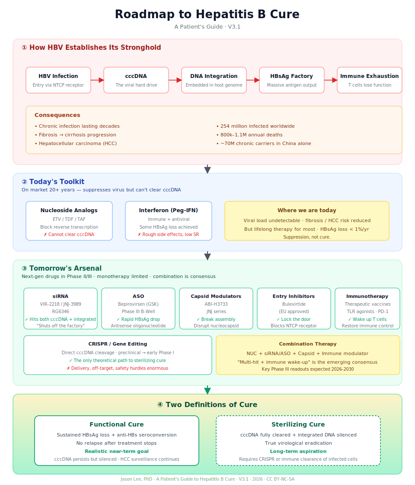

# A Patient's Guide to Hepatitis B Cure

> From virus to cure — one patient's exploration and roadmap.

**Version**: V3.1 · Full draft complete
**Author**: Jason Lee, PhD
**English Version** (this folder) · [中文版](../README.md)
**Free to read forever** — no fees, no ads, no paywall

---

## About This Book

I'm not a doctor. I'm a lifelong hepatitis B carrier, an engineer, and a researcher.

For years I've been following this disease — reading papers, tracking clinical trials, following drug pipelines, talking to doctors and other patients. Along the way, I noticed something —

**Scientists are already talking about "cure," while many patients are still struggling to read a lab report.**

This book is meant to close a little of that gap. It's not a medical textbook and it can't replace your doctor. It's a patient's notebook, a map for fellow travelers.

**This book will always be free.** You can read it, download it, share it, translate it. Just don't sell it commercially, and please tell others who need it.

---

## The Whole Book in One Picture

  

Four sections:

1. **How HBV establishes its stronghold** → Part 1 What (Ch 1-5)
2. **Today's toolkit** → Part 4 How (Ch 15-20)
3. **Tomorrow's arsenal** → Part 5 New Research (Ch 21-29)
4. **Two definitions of cure** → Part 6 Future (Ch 30-34)

---

## Table of Contents

### Front Matter
- [Preface · Why I Wrote This Book](./00-preface.md)
- [How to Read This Book](./00-how-to-read.md)

### Part 1 · What · Understanding HBV
- [Ch 1 It Started with a Drop of Blood](./01-drop-of-blood.md)
- [Ch 2 HBV Virology Basics](./02-virology-basics.md)
- [Ch 3 cccDNA · The Viral Hard Drive](./03-cccdna.md)
- [Ch 4 HBV DNA Integration · The Overlooked Side](./04-integration.md)
- [Ch 5 Global and China Epidemiology](./05-epidemiology.md)

### Part 2 · Why · What Makes It So Hard to Treat
- [Ch 6 Immune Tolerance and T Cell Exhaustion](./06-immune-tolerance.md)
- [Ch 7 Why cccDNA Can't Be Cleared](./07-why-cccdna-persists.md)
- [Ch 8 Where Does HBsAg Come From](./08-hbsag-sources.md)
- [Ch 9 HBV vs HCV vs HIV](./09-hbv-vs-hcv-hiv.md)

### Part 3 · Diagnosis · Reading Your Own Disease
- [Ch 10 Reading a Lab Report](./10-lab-report.md)
- [Ch 11 Viral Load and HBsAg Quantification](./11-viral-load.md)
- [Ch 12 Fibrosis Staging](./12-fibrosis.md)
- [Ch 13 Imaging](./13-imaging.md)
- [Ch 14 Who Needs Treatment · Three Guidelines Compared](./14-guidelines.md)

### Part 4 · How · Today's Treatment
- [Ch 15 Nucleos(t)ide Analogs](./15-nucs.md)
- [Ch 16 Long-Term Management · Bone, Kidney, Metabolism](./16-long-term.md)
- [Ch 17 Interferon · An Old Drug Reconsidered](./17-interferon.md)
- [Ch 18 What Is "Functional Cure"](./18-functional-cure.md)
- [Ch 19 The Science of Stopping Therapy](./19-stopping.md)
- [Ch 20 Lifestyle](./20-lifestyle.md)

### Part 5 · New Research · The Drug Revolution
- [Ch 21 Why the Future Is Combination Therapy](./21-combination.md)
- [Ch 22 siRNA](./22-sirna.md)
- [Ch 23 ASO and Bepirovirsen](./23-aso.md)
- [Ch 24 Capsid Assembly Modulator](./24-capsid.md)
- [Ch 25 Entry Inhibitors and Bulevirtide](./25-entry.md)
- [Ch 26 Therapeutic Vaccines](./26-vaccines.md)
- [Ch 27 Immunotherapy](./27-immunotherapy.md)
- [Ch 28 CRISPR and Gene Editing](./28-crispr.md)
- [Ch 29 Combination Regimens in Trials](./29-regimens.md)

### Part 6 · Future · The Next Ten Years
- [Ch 30 From Functional to Sterilizing Cure](./30-two-cures.md)
- [Ch 31 AI and Drug Discovery](./31-ai.md)
- [Ch 32 Personalized Treatment](./32-personalized.md)
- [Ch 33 Can HBV Be Eradicated](./33-eradication.md)
- [Ch 34 What Patients Should Do](./34-patient-actions.md)

### Part 7 · Summary · A Patient's Methodology
- [Ch 35 How a Patient Reads Papers](./35-reading-papers.md)
- [Ch 36 How to Evaluate a "New Drug"](./36-evaluating-drugs.md)
- [Ch 37 How to Spot Fake News and "Miracle Cures"](./37-fake-cures.md)
- [Ch 38 Patient Communities and Information Sources](./38-communities.md)
- [Ch 39 The Grand Roadmap](./39-grand-roadmap.md)

### Appendices
- [A · HBV Terms and Abbreviations](./A-glossary.md)
- [B · Drug Development Timeline](./B-timeline.md)
- [C · Companies and Pipelines](./C-companies.md)
- [D · Key Clinical Trials Index](./D-trials.md)
- [E · Patient FAQ · 100 Questions](./E-faq.md)
- [F · References and Further Reading](./F-references.md)

---

## Version History

| Version | Date | Changes |
|---------|------|---------|
| V3.1 | 2026-07-05 | Full draft (39 chapters + appendices A-F). Data to be re-verified against WHO 2025 report and Polaris. |
| V3.0 | 2026-07 | Structural refactor: 7 parts, 39 chapters |
| V2.0 | — | 8-part structure |
| V1.0 | — | Outline sketch |

---

## What's Not Done Yet (PRs welcome)

- [ ] Data verification: latest WHO report and Polaris Observatory
- [ ] Chapter-end "key papers" lists
- [ ] More visual diagrams
- [ ] Annual updates on new drug data

---

## Contributing

**Found a mistake? Data outdated? Want to add clinical experience?**

- **GitHub Issue** — report a problem
- **Pull Request** — fix it directly
- **Translation** — especially welcome in Japanese, Korean, Vietnamese

**I don't chase perfection. I chase getting closer to the truth.**

---

## Disclaimer

Nothing in this book constitutes medical advice. Any medication or treatment decision must be made with your physician.

**Any health decision made based on this book is the sole responsibility of the reader. The author bears no direct or indirect medical, legal, or financial liability.**
